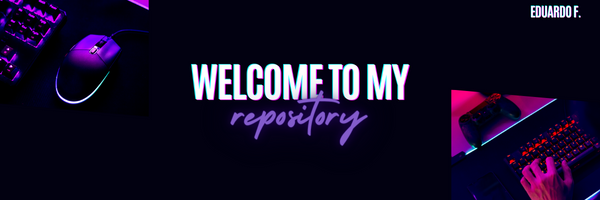

<h1>Hi, I'm Eduardo ✌🏻</h1>

## About Me
+ 💻 FullStack Developer
+ 📖 Self-taught
+ 💘 In love with JS

## Technologies
- JavaScript
- C#
- Node.js
- PostgreSQL
- Microsoft SQL Server
- MongoDB
- WinForms
- .Net Framework 4
- HTML
- CSS

<!--
**Twentyeight07/Twentyeight07** is a ✨ _special_ ✨ repository because its `README.md` (this file) appears on your GitHub profile.

Here are some ideas to get you started:

- 🔭 I’m currently working on ...
- 🌱 I’m currently learning ...
- 👯 I’m looking to collaborate on ...
- 🤔 I’m looking for help with ...
- 💬 Ask me about ...
- 📫 How to reach me: ...
- 😄 Pronouns: ...
- ⚡ Fun fact: ...
-->
